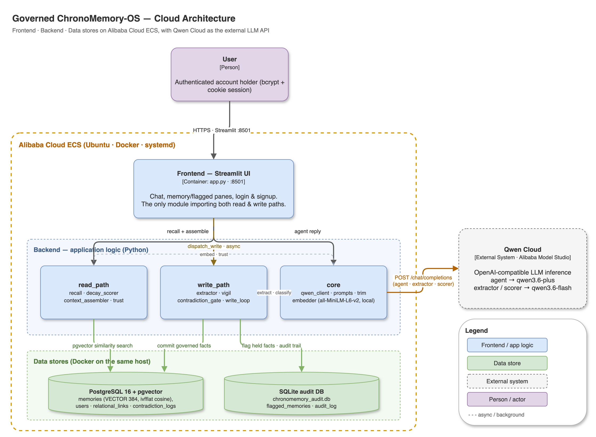
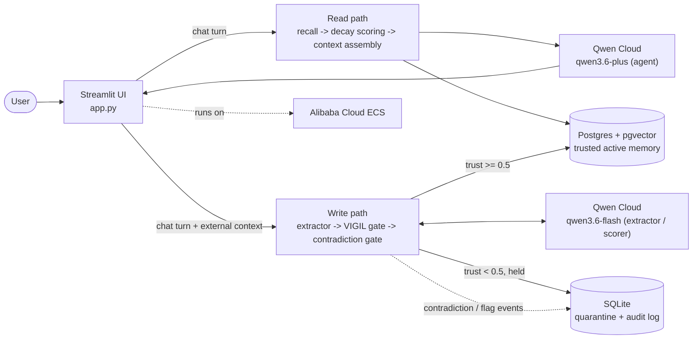

# ChronoMemory

Governed ChronoMemory-OS is a memory layer for LLM agents built around one idea: a fact is only as trustworthy as where it came from. Every memory carries a provenance tag (user turn, agent turn, tool output, third-party message, external doc, or web content), which sets a base trust score before the content is ever evaluated. Facts below a trust threshold are held for human review instead of silently entering active memory — a defense against prompt-injection-style poisoning, not just a recall feature. On top of that, memory decays over time on a Weibull-shaped curve, and contradicting facts are resolved deterministically via LLM-based natural-language-inference classification, with a full audit trail of every decision.

## Track: MemoryAgent

Submission to the Qwen Cloud Global AI Hackathon, Track 1: MemoryAgent — an agent with persistent memory that accumulates experience and recalls critical memories within limited context windows.



<details>
<summary>Mermaid version (renders natively on GitHub, kept as a fallback)</summary>



</details>

## How it works

Trust is assigned once, at write time, purely from where a fact came from (`core/memory_entry.py`):

| Provenance | Trust score |
|---|---|
| `user_turn` | 1.0 |
| `agent_turn` | 0.7 |
| `tool_output` / `stdout` | 0.6 |
| `third_party_message` | 0.55 |
| `external_doc` | 0.4 — held |
| `web_content` | 0.3 — held |

Anything under 0.5 never reaches Postgres. It's written to a separate SQLite database instead — `flagged_memories`, with a matching `audit_log` row — and stays there until a human explicitly promotes it (`write_path/vigil.py`). Content is never a factor in this decision: a well-written, plausible sentence pulled from a URL is held at the same 0.3 as anything else tagged `web_content`, because provenance is the only signal available at the moment a brand-new fact is written.

Memories that do get committed decay on a schedule (`read_path/decay_scorer.py`):

```
effective_half_life = 7 days * min(1 + access_count * 0.5, 5)
freshness = exp(-(elapsed_days / effective_half_life) ** 0.8)
score = importance * relevance_score * freshness
# archived automatically once score < 0.15
```

Retrieval extends a memory's half-life, up to 5x for something reused often, instead of just resetting a timer, and pruning happens lazily — inline, inside `recall()`, whenever a query happens to touch a memory that has decayed past the threshold. There's no separate cleanup job.

When a new fact is written, `write_path/contradiction_gate.py` finds its five nearest existing neighbors and asks an NLI-classification call to label the relationship as `contradiction`, `entailment`, or `neutral`. A contradiction is resolved deterministically: whichever fact has the higher `serial_no` (written more recently) wins, the older one is marked `superseded`, and the decision is logged to `contradiction_logs`. `entailment`/`neutral` results are written to `relational_links` instead, which is what the read path's spreading activation walks.

## Track fit

The track asks for efficient memory storage and retrieval, timely forgetting, and recalling critical memories within limited context windows. Efficient storage and retrieval is pgvector cosine search combined with a one-hop relational spreading-activation walk over already-recalled facts, not just top-k similarity (`read_path/recall.py`). Timely forgetting is the Weibull decay curve above plus lazy pruning plus contradiction-driven supersession, so an outdated fact doesn't just fade — it can also be actively overwritten by a newer one the moment that fact is written (`read_path/decay_scorer.py`, `write_path/contradiction_gate.py`). Limited context windows are handled by a fixed 12,000-character budget, middle-out trimming, and a cached pinned prefix, so a growing memory store doesn't mean growing per-turn prompt cost (`core/trim.py`, `read_path/context_assembler.py`).

## Layout

Code is grouped by bounded context, not by technical type — the same seams the phase history was built along (phase2 = read path, phase3 = write path):

- `core/` — shared primitives with no opinion about read or write: `memory_entry`, `embedder`, `qwen_client`, `prompts`, `trim`.
- `read_path/` — recall and everything that scores, ranks, and trims what the agent sees: `recall`, `decay_scorer`, `context_assembler`, `trust`.
- `write_path/` — turning a turn into a governed memory: `extractor`, `vigil`, `contradiction_gate`, `write_loop`.
- `db/` — one-time setup: `schema.sql` (Postgres), `init_sqlite.py` (audit trail).
- `tests/` — mirrors the same three buckets; run with `python -m tests.run_exit_tests` (add `--live` for the non-deterministic Qwen-judgment suite).
- `app.py` — the Streamlit UI; the only file allowed to import from both `read_path` and `write_path`.

## Running it locally

The app needs its own Postgres (with `pgvector`) and its own Qwen Cloud API key — nothing is bundled, shared, or committed. `.env` is gitignored; you create your own.

1. Python 3.11 — newer versions break the `sentence-transformers`/`torch` wheels used for local embedding.
2. `python3 -m venv .venv && source .venv/bin/activate && pip install -r requirements.txt`
3. Start Postgres with pgvector and load the schema:
   ```
   docker run -d --name chronomem-db -e POSTGRES_PASSWORD=<pw> -e POSTGRES_DB=chronomemory -p 5432:5432 pgvector/pgvector:pg16
   docker exec -i chronomem-db psql -U postgres -d chronomemory < db/schema.sql
   ```
4. Init the SQLite audit database: `python3 db/init_sqlite.py`
5. Create `.env` in the repo root:
   ```
   QWEN_KEY_AGENT=<your Alibaba Model Studio / DashScope API key>
   QWEN_KEY_BACKGROUND=<same key, or a separate one for extraction/scoring>
   CHRONOMEM_DB_HOST=localhost
   CHRONOMEM_DB_NAME=chronomemory
   CHRONOMEM_DB_USER=postgres
   CHRONOMEM_DB_PASSWORD=<the password from step 3>
   CHRONOMEM_AUTH_COOKIE_KEY=<random secret, e.g. python3 -c "import secrets; print(secrets.token_hex(32))">
   ```
   `CHRONOMEM_DEMO_MODE=true` optionally enables the scenario sandbox in the sidebar — it runs the real extraction/VIGIL/NLI logic live but never writes to either database.
6. `streamlit run app.py` → `http://localhost:8501`, then sign up to create your first account.

## Deploying to Alibaba Cloud

Deploy to a single ECS instance running Postgres locally alongside the app:

1. Create a RAM user scoped to `AliyunECSFullAccess` + `AliyunVPCFullAccess`, then `aliyun configure --mode AK`.
2. Provision a VPC/vSwitch/security group (`22/tcp` restricted to your IP, `8501/tcp` scoped or open) and a key pair; launch an instance (e.g. `ecs.t6-c1m2.large`) tagged `app=chronomemory`.
3. `rsync` the repo to `/opt/chronomemory` on the instance, excluding `.git`, `__pycache__`, `.env`, `chronomemory_audit.db`; separately `scp` a `.env` built for the remote host (`CHRONOMEM_DB_HOST=localhost`, since Postgres runs on the same box).
4. On the instance: `CHRONOMEM_DB_PASSWORD=<pw> bash deploy/bootstrap_ecs.sh`
5. Verify from your own machine (needs its own `ALIBABA_CLOUD_ACCESS_KEY_ID` / `ALIBABA_CLOUD_ACCESS_KEY_SECRET`): `python3 deploy/verify_alibaba_deployment.py`
6. Stop the instance (`StopInstance`) when not actively using it — port 8501 has no auth in front of it at the network level, so a running instance is reachable by anyone with the IP.

Proof this actually runs on Alibaba Cloud, not just a claim: [`deploy/verify_alibaba_deployment.py`](deploy/verify_alibaba_deployment.py) calls the Alibaba Cloud ECS OpenAPI (`DescribeInstances`) directly through the `alibabacloud_ecs20140526` SDK and asserts the tagged instance is `Running` with a public IP. That's independent of the second point of Alibaba Cloud usage: [`core/qwen_client.py`](core/qwen_client.py) calls Alibaba's Qwen Cloud (Model Studio/MaaS) endpoint for every chat completion the app makes, across three separate model roles.

## For judges

Fastest path to a working instance:

- Live URL: `http://<ECS_PUBLIC_IP>:8501` <!-- TODO: fill in before submission -->
- Demo credentials: username `<TODO>`, password `<TODO>` <!-- TODO: seed a demo account and fill in, or remove this line and rely on self-serve signup -->
- If the instance is stopped or unreachable, run it locally instead — see "Running it locally" above; everything needed to reach a working app is in this README.

Account creation is self-serve signup, so if no demo credentials are listed above, create your own account from the sign-up form on first load — nothing is gated behind an invite.

## Demo video

[Watch the 3-minute demo](https://youtu.be/27PIl8C0TAk) 

## Scaling past the demo

The parts that matter for scaling are already in place: every user's data is fully isolated end-to-end, concurrent activity from the same user takes turns instead of racing, and live conversation traffic runs on a separate API key from background processing, so a burst of background work never slows down an active chat. Three changes take it from a single running instance to real concurrent multi-user load:

- **Separate answering from bookkeeping.** Right now, answering a question also quietly updates memory records in the background as part of that same request — marking facts as recently used, or as expired. Under real traffic, that ties how fast you get an answer to how much bookkeeping is happening at the same time. The fix is to make answering a pure read, and move all the bookkeeping into a queue that a separate background process works through — which also makes those updates durable, so none of them get lost if the app restarts mid-update.


## License

MIT — see [LICENSE](LICENSE).
